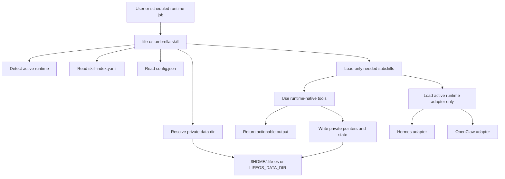
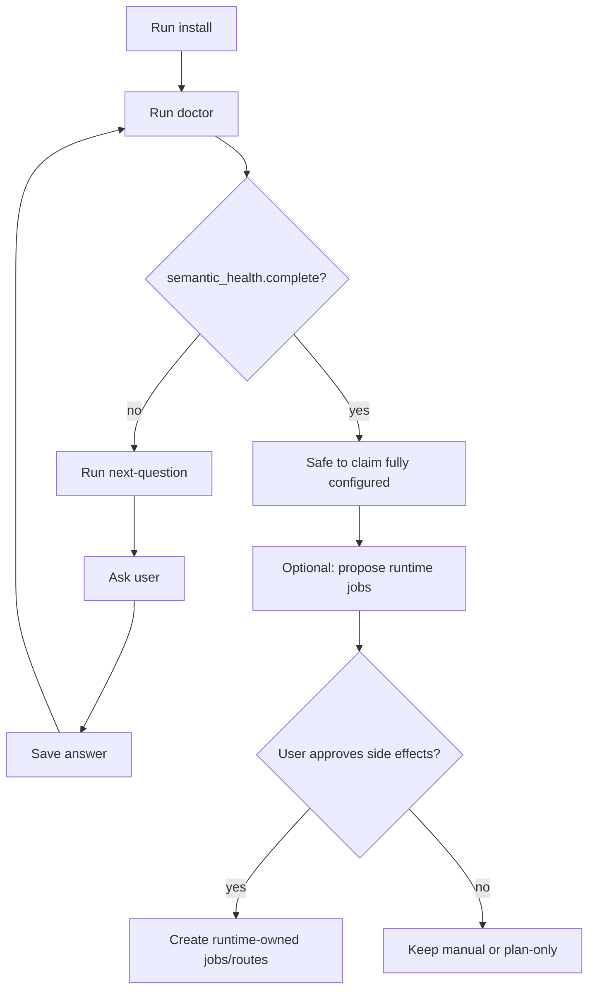

# Agentic Life OS

A portable personal advisor OS built from Agent Skills.

Agentic Life OS is a skill pack for agents that need to help with day-to-day context, routines, tasks, reminders, relationships, documents, health trends, finance checks, purchases, travel, learning, work evidence, and digital hygiene without becoming a giant private database.

The design is simple: keep real user data in the runtime or external system that already owns it, keep public skills generic, and store only private pointers, decisions, and operational state in a local Life OS data directory.

## Index

- [What this is](#what-this-is)
- [What this is not](#what-this-is-not)
- [Architecture at a glance](#architecture-at-a-glance)
- [Request flow](#request-flow)
- [Execution modes](#execution-modes)
- [Runtime model](#runtime-model)
- [Data model](#data-model)
- [Skill structure](#skill-structure)
- [Install model](#install-model)
- [Quick start](#quick-start)
- [CLI helper](#cli-helper)
- [Semantic setup loop](#semantic-setup-loop)
- [Safety and privacy boundaries](#safety-and-privacy-boundaries)
- [Validation](#validation)
- [Status](#status)
- [Roadmap](#roadmap)
- [License](#license)

## What this is

Agentic Life OS is a **portable coordination layer** for personal-advisor agents.

It provides:

- an umbrella `life-os` skill
- 31 lazy-loaded subskills
- runtime adapters for Hermes and OpenClaw
- deterministic helper commands for install, doctor, setup questions, config, and plans
- JSON schemas for private per-skill state
- public-safe playbooks for personal routines, domain workflows, and system self-improvement

It is designed for agent runtimes that already have tools for memory, tasks, cron, mail, calendar, docs, browser, vaults, and message delivery.

## What this is not

Agentic Life OS is **not**:

- a replacement task manager
- a calendar backend
- a password manager
- a medical record system
- a bank or finance database
- a contact database
- a second memory store for raw private data
- a runtime-specific app hard-coded to one user's setup

If a runtime or external app already owns the real data, Life OS stores a pointer and access notes, not a duplicate copy. Duplicating someone's life into another JSON swamp is bad architecture wearing a fake mustache.

## Architecture at a glance



The important bit: runtime instructions live in separate Markdown adapter files. A task loads the active runtime adapter only. Hermes and OpenClaw instructions should not be shoved into the same prompt just because someone was too lazy to load one file.

## Request flow

```text
user request or scheduled job
  -> life-os umbrella skill
    -> classify intent
    -> load only the matching subskill
    -> load only the active runtime adapter if needed
    -> inspect runtime/external sources read-only first
    -> ask before side effects
    -> save skill-specific source decisions or state pointers
    -> produce compact, actionable output
```

For scheduled routines, silence is allowed. The system should not manufacture noise to prove it is alive.

## Execution modes

Life OS should be understandable from its execution modes, not only from its folder structure. The useful modes are:

- **Manual request**: the user asks for a specific thing now. Load the umbrella skill, classify the intent, load the smallest matching subskill, inspect sources, and answer or act within the normal approval rules.
- **Now context**: a compact orientation pass for immediate focus. It answers what is active, waiting, risky, or worth doing next. It should not become a daily digest.
- **Daily pulse / morning briefing**: a proactive daily decision surface. It checks configured sources, highlights hard constraints and 1-3 useful actions, then skips trivia. Morning is the default mental model, but the actual schedule is a runtime/user choice.
- **Quiet heartbeat**: a frequent silent check for changed state. It reports only actionable deltas such as blockers, failures, deadlines, or watched changes. No “still alive” spam.
- **Review routines**: daily, weekly, monthly, and quarterly reviews. These are slower reflection loops for pruning stale tasks, noticing patterns, reviewing commitments, tuning the system, and adjusting priorities.
- **Domain playbook run**: a focused run inside one domain such as tasks, health trends, finance checkup, travel, purchases, documents, learning, work portfolio, or digital hygiene.
- **System improvement review**: a sprint-review-style feedback loop for Life OS itself. It reviews recent runs and user feedback, finds repeated manual steering, proposes new skills/templates/routine tuning, and keeps an improvement backlog without copying raw private history.
- **Setup / doctor loop**: mechanical install plus semantic setup. It finds missing source decisions, asks only the next useful question, and stores each answer in the owning skill data file.
- **Plan-only mode**: propose schedules, migrations, bridges, or runtime jobs without creating them. This is the safe default before side effects.

Recommended baseline, adapted from the original Life OS rhythm and tightened for agent runtimes:

- heartbeat: every few hours, silent unless actionable
- daily pulse: once per day, usually morning
- daily review: optional, useful when the user has many short-cycle commitments
- weekly review: once per week for commitments, people, projects, stale tasks, and system-improvement candidates
- monthly review: once per month for documents, subscriptions, finance, maintenance, learning, and digital hygiene
- quarterly review: once per quarter for direction, portfolio, large decisions, systems cleanup, and whether Life OS itself is still useful

These are **modes**, not mandatory cron jobs. Runtime cron creation, delivery routes, and external writes remain approval-gated. Life OS can recommend the rhythm; the runtime owns the actual schedule and delivery.

## Runtime model

Hermes and OpenClaw are first-class supported runtimes.

Runtime-wide adapters live here:

```text
skills/life-os/runtimes/hermes.md
skills/life-os/runtimes/openclaw.md
```

Skill-specific runtime adapters live here:

```text
skills/life-os/skills/<skill>/runtimes/hermes.md
skills/life-os/skills/<skill>/runtimes/openclaw.md
```

Rules:

- Load only the active runtime adapter for a task.
- Do not inline Hermes and OpenClaw command blocks together in generic skills.
- Use runtime-native discovery before proposing integrations.
- Ask before changing runtime config, cron jobs, delivery routes, memory, mail, calendar, vaults, or external systems.
- Keep runtime-owned data in the runtime unless the user explicitly chooses otherwise.

## Data model

Private Life OS state lives outside the repo.

Default:

```text
$HOME/.life-os
```

Explicit override:

```text
LIFEOS_DATA_DIR=/path/to/life-os-data
```

Core files:

```text
$LIFEOS_DATA_DIR/config.json
$LIFEOS_DATA_DIR/runtime.json
$LIFEOS_DATA_DIR/installed.json
$LIFEOS_DATA_DIR/<skill-name>/data.json
```

`config.json` is only the global coordination file. It may store:

- active runtime and enablement metadata
- `semantic_setup` status and pointers to the skill that owns each answer
- cross-skill policies that genuinely apply to the whole Life OS install

Domain decisions belong to the relevant skill's own data file. For example, the task source decision belongs in:

```text
$LIFEOS_DATA_DIR/tasks-todo/data.json
```

A skill `data.json` may store:

- source decisions for that domain, such as `tasks -> runtime task system`
- access pointers, such as how that skill finds routine run records or source data
- Life-OS-specific preferences for that domain
- internal state, such as last check time or suppression windows
- dated caches or summaries when useful

Neither global config nor skill data should store:

- credentials or tokens
- raw runtime memory dumps
- full mail, chat, transcript, log, calendar, contact, task, or health exports
- private delivery targets
- identity document numbers
- bank credentials

Use pointers by default. Store real domain data only when it is explicitly a Life OS note, preference, cache, or technical state item.

## Skill structure

```text
skills/
  life-os/
    SKILL.md                    # umbrella entrypoint
    skill-index.yaml            # lazy routing index
    install.yaml                # install metadata
    runtimes/
      hermes.md                 # runtime-wide Hermes adapter
      openclaw.md               # runtime-wide OpenClaw adapter
    skills/
      core-install/
      core-doctor/
      core-config/
      routines-heartbeat/
      routines-pulse/
      routines-daily-review/
      routines-weekly-review/
      routines-monthly-review/
      routines-quarterly-review/
      context-now/
      context-inbox/
      context-commitments/
      events-reminders/
      people-contacts/
      people-followups/
      gifts/
      tasks-todo/
      health-trends/
      finance-checkup/
      household-maintenance/
      documents-renewals/
      travel-planning/
      purchase-decisions/
      learning-projects/
      work-portfolio/
      digital-hygiene/
      decision-journal/
      system-improvement/
      integrations-runtime/
      integrations-calendar/
      integrations-mail/
```

Each domain subskill is a playbook. It defines triggers, source ownership, runtime-adapter rules, output contract, safe state, and side-effect boundaries.

## Skill groups

Core:

- `core-install`: install and runtime registration workflow
- `core-doctor`: health checks and semantic setup checks
- `core-config`: safe private config reads and updates

Context and routines:

- `context-now`, `context-inbox`, `context-commitments`
- `routines-heartbeat`, `routines-pulse`
- `routines-daily-review`, `routines-weekly-review`, `routines-monthly-review`, `routines-quarterly-review`
- `system-improvement`

People, events, tasks, and integrations:

- `events-reminders`
- `people-contacts`, `people-followups`, `gifts`
- `tasks-todo`
- `integrations-runtime`, `integrations-calendar`, `integrations-mail`

Domain playbooks:

- `health-trends`
- `finance-checkup`
- `household-maintenance`
- `documents-renewals`
- `travel-planning`
- `purchase-decisions`
- `learning-projects`
- `work-portfolio`
- `digital-hygiene`
- `decision-journal`
- `system-improvement`

## Install model

Install has two layers.

Mechanical install:

- repo files exist
- the runtime can see the umbrella skill
- private state files exist
- per-skill data containers exist

Semantic install:

- setup questions have been asked
- source decisions have been saved in the owning skill data files
- schedule and delivery policy have been chosen
- routine record sources are known
- system-improvement review policy and backlog source are known
- runtime-owned side effects are approved before being created

Do not claim a full install just because files exist. A complete install requires:

```text
doctor.semantic_health.complete = true
safe_to_claim_fully_installed = true
install_claim = fully_configured
```

If `doctor` says `mechanical_only`, continue the setup loop.

## Quick start

From the repo checkout:

```bash
npm run lifeos -- install --runtime <hermes|openclaw>
npm run lifeos -- doctor
```

If `life-os` is already visible to the runtime, do not re-register it. Just run install and doctor from the checkout.

Hermes visibility check:

```bash
hermes skills list --source all | grep -E 'life-os|tasks-todo'
hermes skills list --enabled-only | grep -E 'life-os|tasks-todo'
```

OpenClaw visibility check:

```bash
openclaw skills list | grep -E 'life-os|tasks-todo'
openclaw skills info life-os
openclaw skills check
```

If the runtime cannot see the skill, use the active runtime adapter to choose the right registration scope and install mode. Ask before choosing symlink vs copy, profile vs workspace, or shared vs agent-specific visibility.

## CLI helper

The helper is deliberately boring. Good. Boring deterministic state tools beat clever scripts that silently make product decisions.

```bash
npm run lifeos -- install --runtime <hermes|openclaw>
npm run lifeos -- doctor
npm run lifeos -- next-question
npm run lifeos -- answer <decision-key> '<answer or runtime pointer>'
npm run lifeos -- plan
npm run lifeos -- config
```

Commands:

- `install --runtime <runtime>`: creates or refreshes private state files in `$HOME/.life-os` by default.
- `doctor`: checks repo shape, private state, and semantic setup health.
- `next-question`: returns the next required setup decision.
- `answer <decision-key> '<answer>'`: saves one approved setup decision.
- `plan`: prints remaining setup steps and cron templates without side effects.
- `config`: prints private Life OS global config plus install/runtime state.

The helper does not create runtime crons, delivery routes, credentials, memory entries, mail/calendar integrations, vault records, or migrations. Domain ownership choices are stored in the owning skill's `data.json`; global `config.json` keeps only install-wide setup status and pointers.

## Semantic setup loop



The loop is intentionally explicit. Setup choices shape behavior, so they should be visible and reversible.

## Safety and privacy boundaries

Safe by default:

- read public repo files
- read Life OS private state
- run doctor/lint/tests
- inspect runtime state with read-only tools
- summarize already available information
- write Life OS operational state when it does not mutate external systems

Requires explicit approval:

- contacting people
- changing external calendar or mail state
- creating, deleting, disabling, or rescheduling runtime crons
- changing runtime config
- changing delivery routes
- writing memory, vault, task, or contact records in the runtime
- broad migrations or imports
- deleting private state
- publishing, pushing, or rewriting public history

Public repo rule:

- no personal data
- no private paths
- no real chat IDs
- no credentials
- no user-specific phrases or language examples
- no raw logs, transcripts, screenshots, audio, exports, or runtime configs

## Validation

```bash
npm run lint             # external scan + public-safety scan + local policy lint
npm run lint:external    # agent-skills-mcp scanner
npm run lint:public-safe # secret/token pattern scan only
npm run lint:local       # repo-specific skill policy checks
npm test                 # helper install/doctor/config smoke tests
```

Expected current shape:

```text
32 skills checked by external scan
31 Life OS subskills in skill-index.yaml
public-safe scan passes
lifeos tests ok
lifeos doctor ok
```

## Status

Operational scaffold is implemented:

- umbrella skill
- 31 subskills
- runtime adapters
- private state install
- doctor checks
- semantic setup questions
- answer persistence
- plan output
- schema and skill linting
- public-safety scan
- CI

Domain skills are playbooks. Runtime cron creation, delivery, external writes, and migrations remain runtime-owned and approval-gated.

## Roadmap

See [`ROADMAP.md`](ROADMAP.md) for autonomy modes, remaining playbooks, runtime adapters, schemas, examples, and non-goals.

## License

MIT
