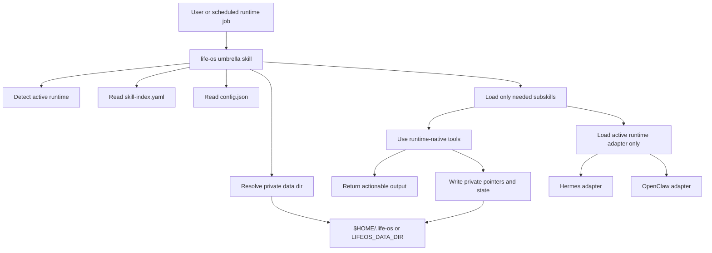
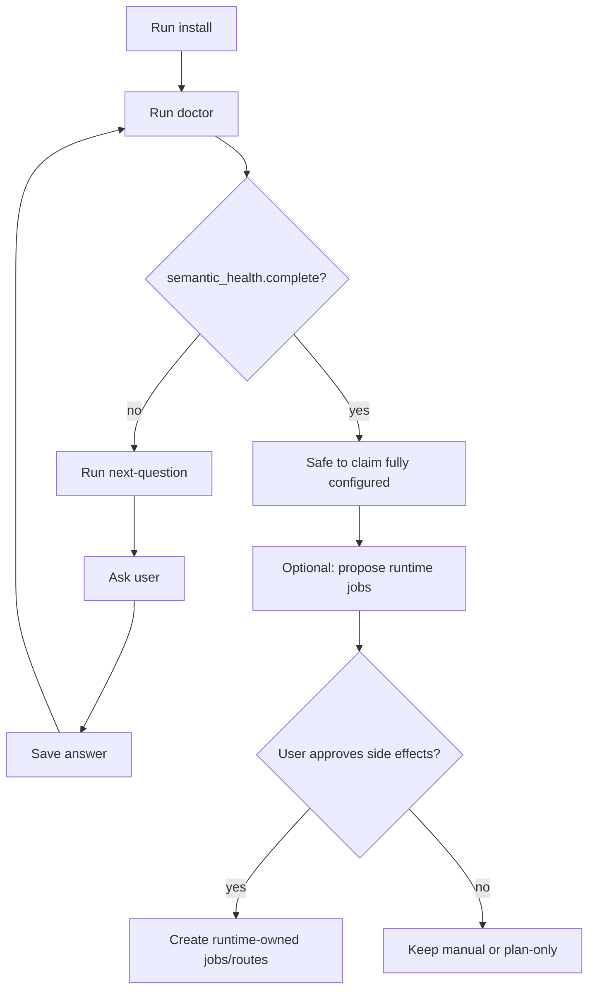

# Agentic Life OS

An agent behavior layer for portable personal-advisor agents.

Agentic Life OS is a skill pack for agents that need to help with day-to-day context, routines, tasks, reminders, relationships, documents, health trends, finance checks, purchases, travel, learning, work evidence, and digital hygiene without becoming a giant private database.

The UX contract is agent-operated: the agent runs helper commands, inspects the active runtime, saves approved pointers/policies, and verifies state. The user gets clear decisions and questions, not instructions to babysit a CLI.

The design is simple: keep real user data in the runtime or external system that already owns it, keep public skills generic, and store only private pointers, decisions, and operational state in a local Life OS data directory.

## Index

- [What this is](#what-this-is)
- [What this is not](#what-this-is-not)
- [Architecture at a glance](#architecture-at-a-glance)
- [Request flow](#request-flow)
- [Execution modes](#execution-modes)
- [Runtime model](#runtime-model)
- [Data model](#data-model)
- [Knowledge bundles](#knowledge-bundles)
- [Skill structure](#skill-structure)
- [Install model](#install-model)
- [Quick start](#quick-start)
- [CLI helper](#cli-helper)
- [Semantic setup loop](#semantic-setup-loop)
- [Safety and privacy boundaries](#safety-and-privacy-boundaries)
- [Validation](#validation)
- [Status](#status)
- [Roadmap](#roadmap)
- [License](#license)

## What this is

Agentic Life OS is a **portable coordination layer** for personal-advisor agents.

It provides:

- an umbrella `life-os` skill
- 31 lazy-loaded subskills
- runtime adapters for Hermes and OpenClaw
- deterministic helper commands for install, doctor, setup questions, config, and plans
- JSON schemas for private per-skill state
- public-safe playbooks for personal routines, domain workflows, and system self-improvement

It is designed for agent runtimes that already have tools for memory, tasks, cron, mail, calendar, docs, browser, vaults, and message delivery.

## What this is not

Agentic Life OS is **not**:

- a replacement task manager
- a calendar backend
- a password manager
- a medical record system
- a bank or finance database
- a contact database
- a second memory store for raw private data
- a runtime-specific app hard-coded to one user's setup

If a runtime or external app already owns the real data, Life OS stores a pointer and access notes, not a duplicate copy. Duplicating someone's life into another JSON swamp is bad architecture wearing a fake mustache.

## Architecture at a glance



The important bit: runtime instructions live in separate Markdown adapter files. A task loads the active runtime adapter only. Hermes and OpenClaw instructions should not be shoved into the same prompt just because someone was too lazy to load one file.

## Request flow

Life OS is the entrypoint. It decides which small playbook to run, where to read from, and what is safe to change.

```text
1. Request arrives
   user message, scheduled job, or resumed guided meeting

2. Load entrypoint
   life-os reads the skill index and private config pointers

3. Classify intent
   decide the mode: context, task, domain skill, heartbeat, review, setup, or plan-only

4. Load only needed skills
   life-os -> selected subskill(s)
   examples: context-now, routines-heartbeat, routines-weekly-review, tasks-todo

5. Load runtime adapter if needed
   Hermes/OpenClaw instructions are loaded only when runtime tools, delivery, scheduling, or runtime-owned data are involved

6. Read sources first
   inspect configured runtime or external sources before proposing changes

7. Decide safety boundary
   safe read/state update -> continue
   external write, cron, delivery, migration, contact, deletion -> ask first

8. Act or ask
   execute the selected playbook, or ask one focused question if a decision is needed

9. Store only pointers/state
   global config for horizontal choices
   skill data for domain-specific state
   never store secrets or raw private dumps

10. Return output
   compact answer, guided-meeting question, actionable alert, or silence for no-news routines
```

Short version:

```text
life-os -> classify -> load subskill -> load runtime adapter if needed -> read -> ask before side effects -> write safe state -> answer or stay silent
```

## Execution modes

- **Manual request**
  - `life-os` -> matching domain skill
  - Examples: `tasks-todo`, `health-trends`, `finance-checkup`, `travel-planning`, `purchase-decisions`, `work-portfolio`

- **Now context**
  - `life-os` -> `context-now` (focus, waiting, risk, next action)

- **Daily briefing**
  - `life-os` -> `routines-pulse` (daily briefing)
  - Default cadence: daily, usually morning

- **Quiet heartbeat**
  - `life-os` -> `routines-heartbeat` (active watch targets)
  - Default cadence: every few hours, silent unless actionable

- **Guided review meetings**
  - `life-os` -> `routines-weekly-review` (due weekly review items)
  - `life-os` -> `routines-monthly-review` (monthly reset items)
  - `life-os` -> `routines-quarterly-review` (quarterly reset items)
  - Optional: `system-improvement` (routine tuning, skill candidates, heartbeat candidates)

- **System improvement**
  - `life-os` -> `system-improvement` (feedback loop, improvement backlog, routine tuning)

- **Setup / doctor**
  - `life-os` -> `core-install`, `core-doctor`, or `core-config`
  - Helper: `scripts/lifeos.py` (install, doctor, plan, config, answer)

- **Plan-only**
  - `life-os` -> relevant subskill(s) plus runtime adapter if needed
  - Output: proposed schedules, migrations, bridges, or runtime jobs, with no side effects

Review meetings are containers for due review items, not fixed bundles. Each review item can have its own cadence: daily, weekly, every two weeks, monthly, quarterly, manual only, or change-triggered.

## Runtime model

Hermes and OpenClaw are first-class supported runtimes.

Runtime-wide adapters live here:

```text
skills/life-os/runtimes/hermes.md
skills/life-os/runtimes/openclaw.md
```

Skill-specific runtime adapters live here:

```text
skills/life-os/skills/<skill>/runtimes/hermes.md
skills/life-os/skills/<skill>/runtimes/openclaw.md
```

Rules:

- Load only the active runtime adapter for a task.
- Do not inline Hermes and OpenClaw command blocks together in generic skills.
- Use runtime-native discovery before proposing integrations.
- Ask before changing runtime config, cron jobs, delivery routes, memory, mail, calendar, vaults, or external systems.
- Keep runtime-owned data in the runtime unless the user explicitly chooses otherwise.

## Data model

Private Life OS state lives outside the repo.

Default:

```text
$HOME/.life-os
```

Explicit override:

```text
LIFEOS_DATA_DIR=/path/to/life-os-data
```

Core files:

```text
$LIFEOS_DATA_DIR/config.json
$LIFEOS_DATA_DIR/runtime.json
$LIFEOS_DATA_DIR/installed.json
$LIFEOS_DATA_DIR/<skill-name>/data.json
```

`config.json` is the global coordination file. It may store:

- active runtime and enablement metadata
- `semantic_setup` status
- horizontal core source pointers used by many skills, such as tasks, memory/context, calendar, and routine run records
- optional knowledge/context source pointers used by many skills
- horizontal policies, such as trigger defaults, schedule policy, delivery policy, and approval behavior

Example global pointers:

```json
{
  "sources": {
    "tasks": { "answer": "runtime task system" },
    "memory": {
      "answer": "runtime memory/context",
      "usage": "follow the active runtime's memory instructions; read compact memory first; follow curated pointers only when relevant; do not duplicate raw memory into Life OS"
    },
    "cron_records": { "answer": "runtime cron history" }
  },
  "policies": {
    "delivery_policy": { "answer": "runtime-owned delivery alias" },
    "review_cadence": { "answer": "review meetings have their own cadences; system-improvement is monthly by default as a due review item, silent when nothing needs input" },
    "review_cron_install_policy": { "answer": "runtime review crons installed/reused, or explicit manual-only opt-out" }
  }
}
```

A skill `data.json` stores only what is specific to that skill:

- source decisions for that domain only
- access pointers only that domain needs
- Life-OS-specific preferences for that domain
- internal state, such as last check time or suppression windows
- dated caches or summaries when useful

Neither global config nor skill data should store:

- credentials or tokens
- raw runtime memory dumps
- full mail, chat, transcript, log, calendar, contact, task, or health exports
- private delivery targets
- identity document numbers
- bank credentials

Use pointers by default. Store real domain data only when it is explicitly a Life OS note, preference, cache, or technical state item.

## Knowledge and context sources

Life OS should adapt to the user's existing runtime, notes, memory, wiki, calendar, task, and automation setup. It should not impose a new knowledge structure.

Private config stores pointers and instructions for how to access each source. Real operational data still belongs in runtime tools or external systems. Life OS-owned data should stay limited to plugin state such as source mappings, usage policy, cron/review state, meeting progress, small caches, and Life-OS-created notes.

Rules:

- Store source pointers and access instructions in private config, not public skills.
- Domain-only source pointers belong in the owning skill data file.
- Prefer runtime-native curated context over raw archives or exports.
- Ask before bulk-converting, moving, deleting, or publishing a user's existing knowledge store.

## Skill structure

```text
skills/
  life-os/
    SKILL.md                    # umbrella entrypoint
    skill-index.yaml            # lazy routing index
    install.yaml                # install metadata
    runtimes/
      hermes.md                 # runtime-wide Hermes adapter
      openclaw.md               # runtime-wide OpenClaw adapter
    skills/
      core-install/
      core-doctor/
      core-config/
      routines-heartbeat/
      routines-pulse/
      routines-daily-review/
      routines-weekly-review/
      routines-monthly-review/
      routines-quarterly-review/
      context-now/
      context-inbox/
      context-commitments/
      events-reminders/
      people-contacts/
      people-followups/
      gifts/
      tasks-todo/
      health-trends/
      finance-checkup/
      household-maintenance/
      documents-renewals/
      travel-planning/
      purchase-decisions/
      learning-projects/
      work-portfolio/
      digital-hygiene/
      decision-journal/
      system-improvement/
      integrations-runtime/
      integrations-calendar/
      integrations-mail/
```

Each domain subskill is a playbook. It defines triggers, source ownership, runtime-adapter rules, output contract, safe state, and side-effect boundaries.

## Skill groups

Core:

- `core-install`: install and runtime registration workflow
- `core-doctor`: health checks and semantic setup checks
- `core-config`: safe private config reads and updates

Context and routines:

- `context-now`, `context-inbox`, `context-commitments`
- `routines-heartbeat`, `routines-pulse`
- `routines-daily-review`, `routines-weekly-review`, `routines-monthly-review`, `routines-quarterly-review`
- `system-improvement`

People, events, tasks, and integrations:

- `events-reminders`
- `people-contacts`, `people-followups`, `gifts`
- `tasks-todo`
- `integrations-runtime`, `integrations-calendar`, `integrations-mail`

Domain playbooks:

- `health-trends`
- `finance-checkup`
- `household-maintenance`
- `documents-renewals`
- `travel-planning`
- `purchase-decisions`
- `learning-projects`
- `work-portfolio`
- `digital-hygiene`
- `decision-journal`
- `system-improvement`

## Install model

Install has two layers.

Mechanical install:

- repo files exist
- the runtime can see the umbrella skill
- private state files exist
- per-skill data containers exist

Semantic install:

- setup questions have been asked
- horizontal core sources and policies have been saved in `config.json`
- domain-specific decisions have been saved in the owning skill data files
- schedule and delivery policy have been chosen
- routine record sources are known
- system-improvement review policy and backlog source are known
- runtime-owned side effects are approved before being created

Do not claim a full install just because files exist. A complete install requires:

```text
doctor.semantic_health.complete = true
safe_to_claim_fully_installed = true
install_claim = fully_configured
review meeting crons are installed/reused, or the user explicitly opted out/manual-only
```

If `doctor` says `mechanical_only`, continue the setup loop. If it returns `setup_completion.status: incomplete`, surface the checklist to the user and propose completing the installation. Do not keep explaining Life OS features as if setup were finished.

## Dynamic heartbeat vision

The Life OS heartbeat is not a fixed checklist. A fixed checklist is just a normal watchdog with better branding. The heartbeat should be alive over the active runtime:

- discover the runtime capability inventory: skills, tools, adapters, sources, schedules, memory, and delivery surfaces;
- keep active watch targets and candidate watch targets in private state/config;
- decide at run time which targets are due, changed, or worth inspecting;
- dynamically load only the runtime/domain skills needed for those targets;
- use runtime adapters for access, for example mail/calendar/task/cron adapters, instead of copying integration logic into Life OS;
- stay silent unless something actionable changed;
- record missing capabilities and propose setup changes instead of improvising.

The goal is discovery + inventory + dynamic skill loading, not “eight hard-coded things to check forever.”

## Quick start

From the repo checkout:

```bash
npm run lifeos -- install --runtime <hermes|openclaw>
npm run lifeos -- doctor
```

If `life-os` is already visible to the runtime, do not re-register it. Just run install and doctor from the checkout.

Hermes visibility check:

```bash
hermes skills list --source all | grep -E 'life-os|tasks-todo'
hermes skills list --enabled-only | grep -E 'life-os|tasks-todo'
```

OpenClaw visibility check:

```bash
openclaw skills list | grep -E 'life-os|tasks-todo'
openclaw skills info life-os
openclaw skills check
```

If the runtime cannot see the skill, use the active runtime adapter to choose the right registration scope and install mode. Ask before choosing symlink vs copy, profile vs workspace, or shared vs agent-specific visibility.

## CLI helper

The helper is deliberately boring. Good. Boring deterministic state tools beat clever scripts that silently make product decisions.

```bash
npm run lifeos -- install --runtime <hermes|openclaw>
npm run lifeos -- doctor
npm run lifeos -- discover-runtime --runtime <hermes|openclaw>
npm run lifeos -- context-sources
npm run lifeos -- define-heartbeat
npm run lifeos -- propose-watch-targets
npm run lifeos -- next-question
npm run lifeos -- answer <decision-key> '<answer or runtime pointer>' --kind <reuse_existing|manual_only|propose_change|disabled|custom>
npm run lifeos -- plan
npm run lifeos -- config
```

Commands:

- `install --runtime <runtime>`: creates or refreshes private state files in `$HOME/.life-os` by default.
- `doctor`: checks repo shape, private state, and semantic setup health.
- `discover-runtime --runtime <runtime>`: adapter/harness-specific read-only runtime discovery that writes only Life OS private `runtime_inventory`; it records skill sources, tool sources, capabilities, and candidate watch targets without creating/changing runtime jobs or integrations. Do not expand this into universal filesystem/command heuristics for arbitrary runtimes.
- `context-sources`: cheap mechanical context map for `context-now`; reports configured pointers, runtime inventory freshness, capability records, and watch-target counts. It does not inspect live runtime state. If inventory is missing or stale, it tells the agent to use the active harness/runtime-native discovery path.
- `define-heartbeat`: defines the single Life OS heartbeat in private config by selecting an existing runtime heartbeat when present, or recording the quiet-heartbeat creation template when absent. It still does not create or edit runtime crons.
- `propose-watch-targets`: normalizes discovered candidates into an approval queue; it has no side effects and does not activate targets.
- `next-question`: returns the next required setup decision.
- `answer <decision-key> '<answer>' --kind <kind>`: saves one approved setup decision. Use `reuse_existing`, `manual_only`, `propose_change`, `disabled`, or `custom` so future agents can act on structure instead of parsing prose.
- `plan`: prints remaining setup steps and cron templates without side effects.
- `config`: prints private Life OS global config plus install/runtime state.

The helper does not create runtime crons, delivery routes, credentials, memory entries, mail/calendar integrations, vault records, or migrations. Horizontal core choices such as task/memory source and delivery/schedule policy live in global `config.json`; domain-specific state and preferences live in the owning skill's `data.json`.

## Semantic setup loop



The loop is intentionally explicit. Setup choices shape behavior, so they should be visible and reversible.

## Safety and privacy boundaries

Safe by default:

- read public repo files
- read Life OS private state
- run doctor/lint/tests
- inspect runtime state with read-only tools
- summarize already available information
- write Life OS operational state when it does not mutate external systems

Requires explicit approval:

- contacting people
- changing external calendar or mail state
- creating, deleting, disabling, or rescheduling runtime crons
- changing runtime config
- changing delivery routes
- writing memory, vault, task, or contact records in the runtime
- broad migrations or imports
- deleting private state
- publishing, pushing, or rewriting public history

Public repo rule:

- no personal data
- no private paths
- no real chat IDs
- no credentials
- no user-specific phrases or language examples
- no raw logs, transcripts, screenshots, audio, exports, or runtime configs

## Validation

```bash
npm run lint             # external scan + public-safety scan + local policy lint
npm run lint:external    # agent-skills-mcp scanner
npm run lint:public-safe # secret/token pattern scan only
npm run lint:local       # repo-specific skill policy checks
npm test                 # helper install/doctor/config smoke tests
```

Expected current shape:

```text
32 skills checked by external scan
31 Life OS subskills in skill-index.yaml
public-safe scan passes
lifeos tests ok
lifeos doctor ok
```

## Status

Operational scaffold is implemented:

- umbrella skill
- 31 subskills
- runtime adapters
- private state install
- doctor checks
- semantic setup questions
- answer persistence
- plan output
- schema and skill linting
- public-safety scan
- CI

Domain skills are playbooks. Runtime cron creation, delivery, external writes, and migrations remain runtime-owned and approval-gated.

## Roadmap

See [`ROADMAP.md`](ROADMAP.md) for autonomy modes, remaining playbooks, runtime adapters, schemas, examples, and non-goals.

## License

MIT
