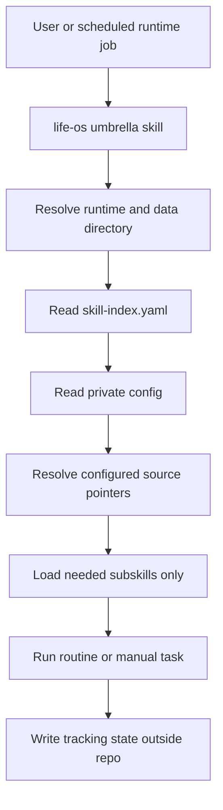

# Agentic Life OS

Life OS keeps real data in runtime or external systems. Its private config stores source pointers and access instructions so the plugin can adapt to the user's existing setup without changing it.
