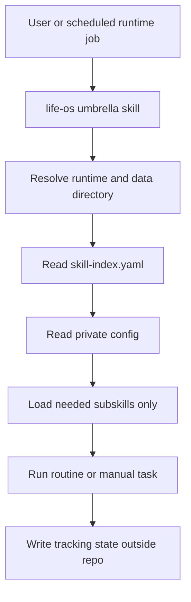

# Agentic Life OS

```mermaid
flowchart TD
  A[User or scheduled runtime job] --> B[life-os umbrella skill]
  B --> C[Resolve runtime and data directory]
  C --> D[Read skill-index.yaml]
  D --> E[Read private config]
  E --> F[Load needed subskills only]
  F --> G[Run routine or manual task]
  G --> H[Write tracking state outside repo]
```
